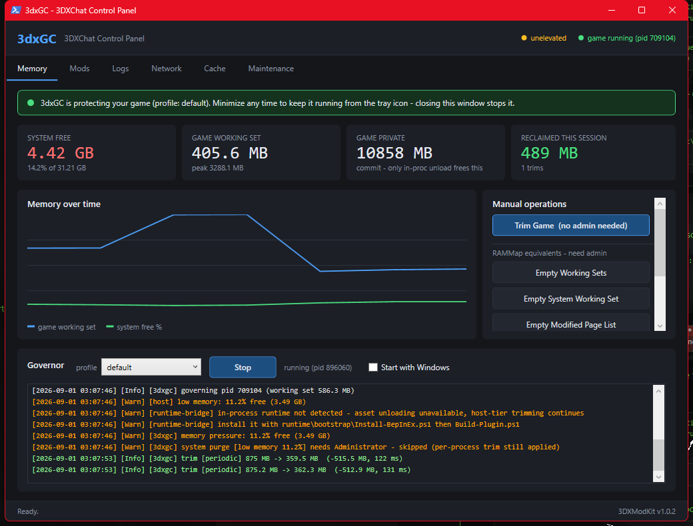

# 3DXModKit

A modular, client-side-only mod framework for **3DXChat** — plus **3dxGC**, a mod that automates what you would otherwise be doing by hand in RAMMap.



Built and tested against:

| | |
|---|---|
| Unity | **2021.3.45f2** |
| Scripting backend | **IL2CPP** (`GameAssembly.dll`, `global-metadata.dat`) |
| Build | 471 (launcher V6) |
| Notable in-process tenants | Vuplex/CEF (`libcef.dll`, 184 MB), Magick.NET, Audio360, OVRPlugin |

---

## Why this exists

There was no mod framework for 3DXChat. What existed:

- **3DXChat Plus** — closed-source, paid, monolithic build. Not extensible.
- **3DXChat Tweaked** — swapped `Assembly-UnityScript.dll`. That is the *pre-IL2CPP* era and does not apply to current builds.
- The wiki's *Plugins and Add-ons* page — mostly standalone external utilities.

No mod loader, no manifest format, no load order, no dependency resolution, no capability model. This is the first.

---

## Client-side only, and enforced

Every mod declares its capabilities in `mod.json`. The loader refuses, unconditionally, anything in these namespaces:

```
net.*                game.protocol.*      game.state.*
account.*            runtime.patch.net*
```

There is deliberately **no config switch to override this**. A mod that asks for network or protocol access does not load:

```
net-sniffer    valid=False  REFUSED capability 'net.socket.read':
                            matches forbidden namespace 'net.' (client-side-only policy)
proto-hack     valid=False  REFUSED capability 'game.protocol.send': ...
```

The same rule is enforced a second time *inside* the game process: `ClientOnlyGuard` vets every Harmony patch target and refuses anything resolving into `System.Net`, `UnityEngine.Networking`, `Photon`, `LiteNetLib`, `Mirror`, `BestHTTP`, and friends. Editing a `mod.json` by hand does not get you past it, because the patch simply never applies.

Nothing in this framework touches the wire, the protocol, or server-authoritative state. It manages memory.

---

## The two tiers, and why both are needed

This is the part that actually matters for your 4 GB idle.

**`EmptyWorkingSet` does not reduce a process's committed memory.** It evicts resident pages to the standby list. They are reclaimable by other processes, but the game still references them, so they fault back in. Measured on this machine during development:

```
javaw   working set 7,989 MB -> 219 MB      (594 MB returned to the system)
        private bytes 14,837 MB -> 14,835 MB   <-- essentially unchanged
```

Minutes later that process was back at 8,087 MB. That is the mechanic, not a bug — and it is why a blind RAMMap timer trades stutter for numbers that do not stick.

| Tier | Runs | Mechanism | Effect |
|---|---|---|---|
| **Host** (external) | Outside the game | `EmptyWorkingSet`, standby/modified-list purges | Lowers **resident** footprint. No game files touched. |
| **Runtime** (in-process) | Inside the game | `Resources.UnloadUnusedAssets()` + `GC.Collect()` | Lowers **committed** memory — actually releases it. |

Only in-process code can free the textures, meshes and audio clips Unity is still holding from rooms and avatars you already left. That is where a multi-GB idle footprint lives. The host tier alone shuffles pages; the runtime tier alone leaves resident junk behind. `runtime-bridge` sequences them: unload first, then trim, so the trim operates on a genuinely smaller process.

The host tier works fine on its own if you never install the runtime.

---

## Install

**[Download the latest release](https://github.com/Deaeath/3DXModKit/releases/latest)**, extract the folder anywhere, and double-click:

```
3dxGC.bat
```

That is the whole install. No setup, no dependencies, no build step — Windows PowerShell 5.1 ships with Windows and is all the host tier needs.

The launcher asks for administrator once, because four of the five RAMMap-equivalent operations need it. **Decline and it still runs** — per-process trimming needs no privileges; you just lose the system-wide purges.

> Extract the folder before running. Launching from inside the .zip leaves Windows' temp copy without the `gui\` and `src\` folders, and the launcher will tell you so.

Prefer git?

```powershell
git clone https://github.com/Deaeath/3DXModKit.git
cd 3DXModKit
.\3dxGC.bat                  # GUI
.\modkit.ps1 status          # command line
```

### GUI

`gui\Start-Gui.ps1` is a WPF control panel with a system tray icon, designed so there is nothing to figure out:

- **Starts governing on its own.** No click required — it launches with your last-used profile (or `default`, the first time) already running.
- **Minimising hides it to the tray**, not the taskbar — the governor keeps running. Closing the window (the X button, or **Exit** in the tray menu) stops it for real.
- **Updates itself.** It checks for a newer release every few hours and on launch, and if one exists, downloads, verifies, and applies it — restarting itself automatically once the swap is done. No download-and-reinstall, ever.
- **"Start with Windows"** checkbox (next to the profile picker) so you never have to open it at all — check it once, forget the app exists.

The onboarding banner at the top of the Memory tab always tells you the current state in plain language. That's the whole manual.

Tabs: **Memory** (live graph, manual RAMMap operations, governor + streaming log), **Mods** (validation and the refusal policy), and **Logs / Network / Cache / Maintenance**, which front the scripts from the companion [3DXChat Debug Toolkit](#companion-toolkit) if you have it.

Launch it elevated to enable the four system-wide operations.

```powershell
.\gui\Start-Gui.ps1 -Minimized                       # start straight to tray
.\gui\Start-Gui.ps1 -ToolkitPath "D:\path\to\toolkit"
```

Auto-update is on by default. To turn it off, set `"AutoUpdateEnabled": false` in `config\gui-settings.json` (created on first run) — there's no UI toggle for this by design; it's a power-user escape hatch, not something most people should need.

### Command line

### Host tier (no game files touched)

```powershell
.\modkit.ps1 run -ProfileName default
```

Run the shell **as Administrator** to unlock the system-wide purges. Without elevation, per-process trimming still works and the system-wide operations report themselves as skipped rather than failing silently.

### Runtime tier (writes into the game directory)

Read `runtime/bootstrap/Install-BepInEx.ps1`'s header before running it. Summary of what you are accepting:

- The game ships a **PGP-signed `integrity.conf`** in both `Game\` and `Launcher\`. Adding files diverges from that manifest.
- 3DXChat is a live service tied to your account; loading code into the client is a ToS question, not only a technical one.
- The launcher may restore modified files and silently undo the install.

```powershell
cd runtime\bootstrap
.\Install-BepInEx.ps1 -GamePath "C:\...\3DXChat\Game"
# launch the game once, let it idle at the login screen while interop assemblies generate
.\Build-Plugin.ps1  -GamePath "C:\...\3DXChat\Game"
```

Every file added is recorded, so revert is exact:

```powershell
.\Uninstall-BepInEx.ps1 -GamePath "C:\...\Game" -BackupPath "..\..\backups\<timestamp>"
```

---

## Commands

```
.\modkit.ps1 status              environment, memory, game state
.\modkit.ps1 list                installed mods
.\modkit.ps1 validate            validate every manifest
.\modkit.ps1 caps                capability catalog + refusal policy
.\modkit.ps1 profiles            available modpacks
.\modkit.ps1 empty -Target Game  fire a RAMMap operation now
.\modkit.ps1 run -ProfileName default
.\modkit.ps1 watch               live memory readout
```

`empty` targets map 1:1 onto RAMMap's menu:

| `-Target` | RAMMap equivalent | Needs admin |
|---|---|---|
| `Game` | *(per-process, not in RAMMap)* | no |
| `WorkingSets` | Empty Working Sets | yes |
| `SystemWorkingSet` | Empty System Working Set | yes |
| `ModifiedList` | Empty Modified Page List | yes |
| `Standby` | Empty Standby List | yes |
| `LowPriorityStandby` | Empty Priority 0 Standby List | yes |
| `All` | all five, in menu order | yes |

---

## Profiles (modpacks)

A profile is a named set of enabled mods plus their config.

| Profile | Behaviour |
|---|---|
| `default` | Adaptive. Unload + trim only when backgrounded, minimised, or idle. System purges only when critical. |
| `aggressive` | Closest to RAMMap-by-hand. Short debounces, periodic sweeps, purges whenever RAM dips. Expect occasional hitching. |
| `conservative` | Never touches anything while the game is in use. No system purges. |
| `host-only` | External tier only. Nothing written to the game directory. |

---

## Measured

Real numbers from this machine, driven end-to-end through the framework:

```
[host]            low memory: 8.3% free (2.58 GB)
[3dxgc]           trim [low memory 8.3%] 8088.8 MB -> 54.4 MB  (-8034.4 MB, 1389 ms)
```

---

## Writing a mod

See [docs/WRITING-MODS.md](docs/WRITING-MODS.md). The short version — a mod is a directory with `mod.json` and an entry script that returns a hashtable:

```powershell
@{
    Initialize = {
        param($ctx)
        $ctx.On('game.minimized', { param($e) $ctx.TrimGame() }.GetNewClosure())
    }
    Shutdown = { param($ctx) }
}
```

`$ctx` only carries the methods your declared capabilities entitle you to. Omit `memory.trim.system` and `PurgeStandbyList` is not on the object at all — the manifest is the access boundary, not documentation.

---

## Layout

```
3DXModKit/
├── 3dxGC.bat                     double-click launcher (self-elevating)
├── modkit.ps1                    CLI
├── 3DXModKit.psm1                module entry point
├── gui/
│   ├── Start-Gui.ps1             WPF control panel + system tray
│   └── MainWindow.xaml           layout
├── src/
│   ├── Native/MemoryApi.cs       P/Invoke: all 5 RAMMap ops + telemetry
│   ├── Core/Manifest.ps1         schema, capability model, validation
│   ├── Core/Resolver.ps1         discovery, dependency graph, load order
│   ├── Core/Config.ps1           layered config (defaults < profile < user)
│   └── Host/Runtime.ps1          event bus, scheduler, capability-gated context
├── mods/
│   ├── 3dxgc/                    adaptive working-set governor (3dxGC)
│   └── runtime-bridge/           host <-> in-process bridge
├── runtime/
│   ├── bootstrap/                BepInEx install / build / uninstall
│   └── src/ModKit.Runtime/       BepInEx 6 IL2CPP plugin
├── profiles/                     modpack definitions
└── logs/
```

---

## Companion toolkit

The Logs, Network, Cache, and Maintenance tabs shell out to the scripts from the 3DXChat Debug Toolkit. Point the GUI at it with `-ToolkitPath`, or ignore those tabs — nothing else depends on them.

---

## Known constraints

- **Trimming is not free.** Every evicted page is a hard fault later. `conservative` exists for a reason.
- **Controlled Folder Access** will block 3DXModKit from writing its `logs\` and `config\` if you place it under `Documents\`, `Pictures\`, or another protected folder. CFA reports this as a misleading *"Could not find file"* rather than access-denied. Either install elsewhere or allow PowerShell through Defender.
- **Building the runtime plugin needs a .NET SDK ≥ 5.0** (for `netstandard2.1`). The host tier needs no SDK at all.
- **Interop assemblies must be generated first** — launch the game once after installing BepInEx, before `Build-Plugin.ps1` will compile.
- **The launcher may revert game-directory changes**, silently undoing a BepInEx install.

---

## Contributing

Mods are the intended extension point — see [docs/WRITING-MODS.md](docs/WRITING-MODS.md). A mod is a folder with a `mod.json` and an entry script; the loader handles discovery, dependencies, ordering, and config.

Pull requests that add capabilities to the forbidden namespaces (`net.*`, `game.protocol.*`, `game.state.*`, `account.*`) will not be merged. That boundary is the point of the project.

---

## License

[MIT](LICENSE).

Not affiliated with, endorsed by, or supported by SexGameDevil. 3DXChat is their product. This is an independent, client-side tool that manages memory on your own machine; installing the optional in-process tier modifies your game directory, which is your decision and your risk.
